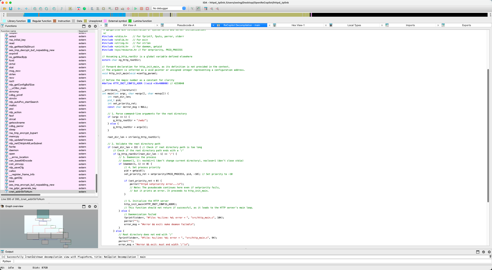

# OpenReCopilot

OpenReCopilot 是对 [ReCopilot](https://tqgpt.qianxin.com/recopilot/) IDA Pro 插件的逆向工程项目。ReCopilot 是一个基于 AI 的二进制分析辅助工具，原版使用 PyArmor 进行代码保护。本项目通过逆向工程恢复了其源代码，使其可以与任意兼容 OpenAI API 的大语言模型配合使用。

## 声明

本项目仅供学习和研究目的。请遵守相关法律法规，尊重原作者的知识产权。

## 致谢

本项目的 PyArmor 解密工作基于以下开源项目：

- **[Pyarmor-Static-Unpack-1shot](https://github.com/Lil-House/Pyarmor-Static-Unpack-1shot)** - PyArmor 静态解包工具，用于恢复受保护的 Python 字节码

解密后的代码经过 LLM 辅助重写和人工整理，修复了大量逆向过程中产生的问题。

## 功能特性

- **函数整体分析** - 分析函数语义、变量类型、参数名称等
- **反编译优化** - 生成更易读的反编译代码
- **变量分析** - 分析特定变量或所有变量的类型和名称
- **参数分析** - 分析函数参数的类型和语义
- **函数名恢复** - 从语义推断有意义的函数名称
- **支持第三方 API** - 可配置使用任意兼容 OpenAI API 的模型

## 支持的模型

| API 提供商 | Base URL | Model Name 示例 |
|-----------|----------|-----------------|
| OpenAI | (留空) | gpt-4o, gpt-4-turbo |
| DeepSeek | https://api.deepseek.com | deepseek-chat |
| Ollama (本地) | http://localhost:11434 | llama3, qwen2 |
| OpenRouter | https://openrouter.ai/api | openai/gpt-4o |
| 其他兼容 OpenAI API 的服务 | 自定义 | 自定义 |

## 安装

### 依赖要求

- IDA Pro 7.0+ (带 Hex-Rays Decompiler)
- Python 3.8+
- PyQt5 (通常随 IDA Pro 提供)

### 安装步骤

1. 克隆本仓库：
```bash
git clone https://github.com/YOUR_USERNAME/OpenReCopilot.git
```

2. 安装 Python 依赖：
```bash
pip install -r OpenReCopilot/requirements.txt
```

3. 将 `OpenReCopilot` 文件夹复制到 IDA 插件目录：
   - Windows: `%APPDATA%\Hex-Rays\IDA Pro\plugins\`
   - macOS: `~/.idapro/plugins/`
   - Linux: `~/.idapro/plugins/`

4. 重启 IDA Pro

## 使用方法

### 配置

1. 在 IDA Pro 中，通过菜单 `Edit -> Plugins -> ReCopilot Settings` 打开设置对话框
2. 配置以下参数：
   - **Model Name**: 模型名称（如 `gpt-4o`）
   - **Base URL**: API 地址（使用 OpenAI 官方 API 时留空）
   - **API Key**: 你的 API 密钥
   - **Prompt Template**: 提示词模板（推荐使用 `general`）

### 分析功能

在反编译窗口（Pseudocode）中右键，选择 ReCopilot 菜单项：

- **Function Analysis** - 函数整体分析
- **Decompilation** - 优化反编译
- **All Variables Analysis** - 分析所有变量
- **All Arguments Analysis** - 分析所有参数
- **Specific Variables Analysis** - 分析选定变量
- **Function Name Analysis** - 函数名恢复

## 项目结构

```
OpenReCopilot/
├── recopilot.py        # 插件入口点
├── config.py           # 配置管理
├── handler.py          # 主处理逻辑
├── remote_model.py     # AI 模型 API 调用
├── ext_info.py         # 信息提取和预测应用
├── data_flow.py        # 数据流分析
├── checker.py          # 响应解析和验证
├── recopilot_qt.py     # Qt 用户界面
├── task_guides.py      # 任务提示词模板
├── feedback.py         # 反馈系统
├── prompts.json        # 提示词配置
├── ida-plugin.json     # IDA 插件元数据
└── requirements.txt    # Python 依赖
```

## 已知问题

1. **Token 限制** - 分析大型函数时可能超出模型的上下文长度限制，可通过减少 `Max Output Tokens` 或关闭 `Data Flow Analysis` 来缓解

2. **模型输出格式** - 某些模型可能不严格遵循 JSON 输出格式，建议使用 GPT-4o 等能力较强的模型

## 演示



## 贡献

欢迎提交 Issue 和 Pull Request！

## 许可证

本项目仅供学习研究使用。原 ReCopilot 插件的版权归奇安信所有。

## 相关链接

- [ReCopilot 官方网站](https://recopilot.qianxin.com/)
- [Pyarmor-Static-Unpack-1shot](https://github.com/Lil-House/Pyarmor-Static-Unpack-1shot)
- [IDA Pro](https://hex-rays.com/ida-pro/)
